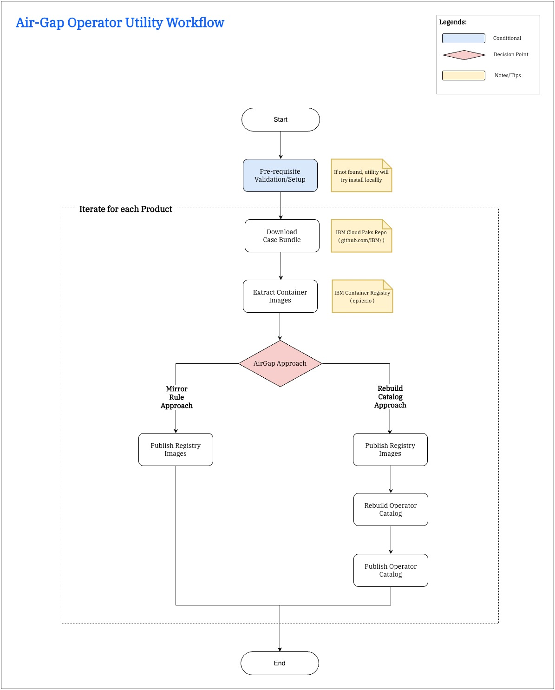
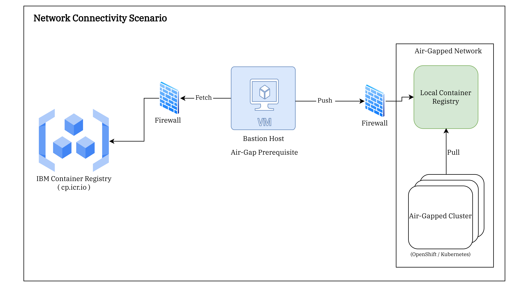
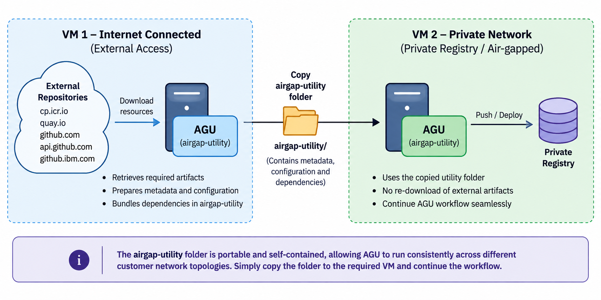

# IBM Engineering Air Gap Utility (AGU)

The IBM Engineering Air Gap Utility (AGU) is an enterprise-grade, menu-driven automation framework designed to enable IBM CloudPak Operator solutions in air-gapped and restricted network environments by mirroring container images, rebuilding operator catalogs, and publishing them to private registries.

The IBM Engineering Air Gap Utility(AGU) focuses on secure container artifact transport, operator catalog preparation, registry enablement, and disconnected environment readiness for enterprise container platforms.

## Table of Contents

- [Overview](#overview)
- [What is an Air-Gapped Environment?](#what-is-an-air-gapped-environment)
- [Key Features](#key-features)
- [Supported Products](#supported-products)
- [Prerequisites](#prerequisites)
   - [CLI Tools](#cli-tools)
   - [Outbound Network Connections](#outbound-network-connections)
   - [Assumptions](#assumption)
- [Supported Platforms](#supported-platforms)
- [Installation](#installation)
- [Usage Guide](#usage-guide)
   - [Multi-Host Execution](#multi-host-execution)
   - [Air-Gapped Enablement Capabilities](#air-gapped-enablement-capabilities)
      - [Approach 1: Image Mirroring Rule](#approach-1-image-mirroring-rule)
      - [Approach 2: Rebuild Catalog Approach(recommended)](#approach-2-rebuild-operator-catalog-recommended)
- [Support](#support)
- [License](#license)

## Overview

Making Operator solutions available in air-gapped environments presents unique challenges.

The IBM Engineering Air Gap Utility (AGU) is an enterprise-grade automation framework for disconnected OpenShift/Kubernetes environments. It orchestrates artifact acquisition, image mirroring, registry population, and operator catalog reconstruction for IBM CloudPak Operator deployments. See [Supported Products](#supported-products) for the complete list.

The utility operates as a **shipping agent** it doesn't deploy operators or manage cluster state. Instead, it ensures that the same operator catalog available in connected environments becomes functionally equivalent in air-gapped registries, allowing **Operator Lifecycle Manager (OLM)** to consume and deploy operators as if they were sourced from connected registries.


- **Utility Workflow:**

   

### What is an Air-Gapped Environment?

An air-gapped architecture refers to a deployment model where systems operate in a fully isolated network with no direct internet access.

In such environments, all required resources - including container images, operator bundles, and dependencies must be pre-downloaded and made available through an internal registry.

Any operations such as application deployment, operator installation, or catalog updates must rely solely on internally hosted artifacts and registry.

As a result, workflows that normally depend on external registries (e.g., public container registries) must be adapted to use mirrored content.

### Key Features

The IBM Engineering Air Gap Utility (AGU) is an enterprise-grade tool designed to bridge the connectivity gap between public operator ecosystems and air-gapped private registries. Rather than a deployment tool, AGU functions as an artifact transport and registry preparation system that enables IBM CloudPak Operator solutions to be mirrored, rebuilt, and made available in disconnected environments.

AGU streamlines three foundational operations in the disconnected content lifecycle

- **Image Pull & Mirror** - Pulls container images from public IBM registries and mirrors them to private registries, preserving image integrity across the air-gap boundary.

- **Catalog Reconstruction** - Rebuilds operator catalogs from case bundles with registry path remapping, ensuring that catalog metadata references the private registry instead of public sources.

- **Solution Packaging** - Packages complete operator solutions (images + catalogs + case metadata) as transferable artifacts that can cross physical security boundaries.

## Supported Products

The AGU utility currently supports the following IBM Engineering products:

| Product | Documentation |
|---------|---------------|
| **IBM Engineering Lifecycle Management on Hybrid Cloud** | [IBM Documentation](https://www.ibm.com/docs/en/engineering-lifecycle-management-suite/lifecycle-management/7.2.0?topic=cloud-release-channels) |
| **IBM Engineering AI Hub**  | [IBM Documentation](https://www.ibm.com/docs/en/engineering-lifecycle-management-suite/lifecycle-optimization-integration-hub) |
| **IBM Rhapsody Systems Engineering** | [IBM Documentation](https://www.ibm.com/docs/en/engineering-lifecycle-management-suite/design-rhapsody) |

## Prerequisites

This utility scripts can be executed on any platform in [supported listed](#supported-platforms)

It is assumed that a bastion host with limited and controlled internet
connectivity is required. This host serves as the only point for external
interactions, enabling tasks such as container image mirroring, downloading
operator case bundle and other approved data transfer operations.

 

### CLI tools

The following CLI tools are required to run the utility. **podman**, **skopeo**, **opm**, and **yq** are automatically downloaded and cached under `.tools/bin/` by the **Pre Requisite** step if they are not already available — no manual installation is needed for those tools.

| Component | Minimum Version | License | Purpose | Auto-installed |
|------------|----------------|----------|----------|:--------------:|
| **podman** | >= 5.6.0 | Apache-2.0 | Daemonless container runtime used for loading and building container images. All helper binaries (`netavark`, `conmon`, `crun`, etc.) are bundled alongside it under `.tools/bin/`. | ✅ Yes |
| **skopeo** | >= 1.20.1 | Apache-2.0 | Copies and mirrors container images between registries without requiring a daemon. | ✅ Yes |
| **opm** | >= 1.50.0 | Apache-2.0 | Operator Package Manager for rendering and rebuilding operator catalogs. | ✅ Yes |
| **yq** | >= 4.44.1 | MIT | Processes and transforms YAML/JSON files used in operator metadata. | ✅ Yes |
| **curl** | >= 7.29.0 | MIT | Downloads artifacts over HTTP/HTTPS. Must be available on the host. | ❌ Host |
| **tar** | >= 1.27 | GPL-3.0 | Extracts archived files and packages. Must be available on the host. | ❌ Host |

> **Note:** Docker is not required. AGU uses podman exclusively as its container runtime.

# Outbound Network Connections

In an air-gapped deployment, the **bastion host** is the only machine with controlled internet access. AGU runs entirely on the bastion host and initiates all external connections from there — the air-gapped cluster itself never contacts any of these endpoints directly.

All connections are **outbound HTTPS over TCP/443**. No inbound firewall rules are required. DNS resolution for each endpoint must be reachable from the bastion host. If the bastion host sits behind a corporate proxy, set `https_proxy` and `no_proxy` before running AGU — both `curl` and `skopeo` honour these environment variables natively.

| Endpoint | Purpose |
|----------|---------|
| `cp.icr.io` | IBM Container Registry — source of all product operator and application images |
| `quay.io` | Red Hat Quay — source of the `opm` (Operator Package Manager) base image |
| `github.com` | GitHub — CLI tool binaries and IBM Cloud Pak case bundle archives |
| `api.github.com` | GitHub REST API — case bundle version discovery |
| `github.ibm.com` | IBM GitHub — Cloud Pak case bundle repository |


### Assumption

Before execution, AGU performs a dependency validation to verify that all required CLI tools are installed. Missing dependencies are automatically installed when possible; otherwise, execution terminates with a descriptive validation error.

This validation step is optional for systems with preinstalled dependencies. Refer to the [required tools](#cli-tools) section for the complete dependency list.

- System Requirements

   | Requirement | Specification |
   |------------|---------------|
   | **Shell** | bash 3.x or later |
   | **Disk Space** | Minimum 50GB available (product-dependent) |
   | **Memory** | 4GB RAM minimum, 8GB recommended |
   | **Network** | Limited Internet connectivity |
   | **Permissions** | Execution |

## Supported Platforms

The AGU utility supports the following platforms:

| Operating System | Architectures | Status |
|-----------------|---------------|---------|
| **Linux** | amd64, arm64, arm | ✅ Supported |
| **Windows** | amd64 (WSL2) | ✅ Supported |

**Platform Requirements:**
- **Linux**: Kernel 3.10+ with bash 3.0+
- **macOS**: macOS 10.15 (Catalina) or later
- **Windows**: Windows 10/11 with WSL2 enabled and Ubuntu 20.04+ distribution

**Note**: The utility automatically detects the host operating system and system architecture during the prerequisite validation phase. If the platform is unsupported, execution terminates gracefully with a descriptive error message.


### Installation

- Download the utility from IBM Jazz download page, [here](https://jazz.net/downloads/air-gap-utility/).

- Extract and locate by entering the directory

   ```bash
   unzip airgap-utility-main.zip;
   cd airgap-utility-main;
   ```

- Verify directory structure

   ```bash
   ls -la code/AGU
   ```

- Make the utility executable

   ```bash
   chmod -R +x code/AGU
   ```

### Usage Guide

The IBM Engineering Air Gap Utility(AGU) execution supports interactive(menu driven) mode which allow users to handle supported type of operations.

The script/s designed in a way that it checks the prerequisites for each activity and tries to execute the operation, If it is not able to succeeded then in such case/s it will provide reference information to the user.

- Supported Operational Activity

   AGU provides the following activities through an interactive CLI-driven workflow:

   | Operation | Description |
   |-----------|-------------|
   | **Pre Requisite** | Validates system requirements and supported tools. |
   | **Download Case Bundle** | Downloads IBM product case bundles containing operator metadata, manifests, and dependency information. |
   | **Extract Container Images** | Pulls container images and packages them as TAR archives for transfer to air-gapped environments. |
   | **Publish Registry Images** | Pushes TAR-archived images to private registries with automatic authentication and configuration. |
   | **Rebuild Operator Catalog** | Reconstructs operator catalogs using downloaded case bundles and images for disconnected clusters. |
   | **Publish Operator Catalog** | Publishes rebuilt catalogs to private registries, making operators available via OpenShift's Operator Lifecycle Manager (OLM). |

## Multi-Host Execution

AGU supports environments where the network connectivity required for different operations is distributed across multiple hosts.

- **Workflow**

   - Run AGU on the host with the required external or private network connectivity.
   - Copy the **complete `airgap-utility` directory** to the next host when required.
   - Run AGU from the copied directory to continue the workflow.
   - Repeat the process as required by the customer's network topology.

   For a example, Customers may have different hosts for external and private network access. The complete `airgap-utility` directory can be copied between hosts, allowing AGU to continue the workflow on the host with the required connectivity.

   


## Air-Gapped Enablement Capabilities

The AGU utility supports two distinct approaches for deploying operators in air-gapped environments. Choose the approach that best fits your organization's requirements and OpenShift or Kubernetes cluster configuration.

### Approach 1: Image Mirroring Rule


Image Mirroring Rule, is a cluster-level configuration that intercepts container image pull requests and transparently redirects them from external registries to internally mirrored registries. While the operator catalog continues to reference public image paths, the cluster runtime resolves and pulls images from the configured private registry in air-gapped environments.

**When to Use:**

- ✅ Prefer minimal catalog modifications.

- ✅ Leverage Red Hat OpenShift Container Platform native mirroring capabilities.

   - More About [ImageDigestMirrorSet](https://docs.redhat.com/en/documentation/openshift_container_platform/4.21/html/config_apis/imagedigestmirrorset-config-openshift-io-v1)

      - Template and sample YAML [ImageDigestMirrorSet](./template/ImageDigestMirrorSet.yaml)
   
   - More About [ImageTagMirrorSet](https://docs.redhat.com/en/documentation/openshift_container_platform/4.21/html/config_apis/imagetagmirrorset-config-openshift-io-v1)

      - Template and sample YAML [ImageTagMirrorSet](./template/ImageTagMirrorSet.yaml)

- ✅ Kubernetes distribution using [CRI-O](https://kubernetes.io/docs/setup/production-environment/container-runtimes/#cri-o) runtime.

   - More About [Configure Image Registry](https://github.com/containers/image/blob/main/docs/containers-registries.conf.5.md).

   - Template and sample YAML [Configure Image Registry](./template/registries.conf)

- ✅ Kubernetes distribution using
[containerd](https://kubernetes.io/docs/setup/production-environment/container-runtimes/#containerd) runtime.

   - More About [Configure Image Registry](https://github.com/containerd/containerd/blob/main/docs/cri/registry.md).

   - Template and sample YAML [config.toml](./template/config.toml), [hosts.toml](./template/hosts.toml)

**Workflow:**

<details>
<summary><b>Click to expand step-by-step instructions</b></summary>

```bash
# Run the AGU utility
./code/AGU
```

**Step-by-step execution:**

1. **Pre-Requisite** (Menu Option 1)
   - Select: `1. Pre Requisite`
   - Choose: `Please select Category` → Select your product category
   - Action: Validates system and downloads required tools

2. **Download Case Bundle** (Menu Option 2)
   - Select: `2. Download Case Bundle`
   - Choose: `Please Select Product` → Select your product
   - Action: Downloads IBM product case bundle with operator metadata

3. **Extract Container Images** (Menu Option 3)
   - Select: `3. Extract Container Images`
   - Choose: `Please Select Product` → Select your product
   - Action: Pulls images from public registry and saves as TAR archives

4. **Publish Registry Images** (Menu Option 4)
   - Select: `4. Publish Registry Images`
   - Choose: `Please Select Product` → Select your product
   - Action: Pushes TAR archives to your private mirror registry

**Post-Deployment:**
- Configure ImageContentSourcePolicy (ICSP) in your OpenShift cluster
- ICSP redirects image pulls from public registry to your mirror registry
- Use the original IBM catalog without modifications

</details>

---

### Approach 2: Rebuild Operator Catalog (Recommended)

**Overview:** This approach rebuilds the operator catalog with registry paths pointing directly to your private registry. The catalog is modified to reference your airgap registry instead of public registries.

**When to Use:**
- ✅ Need for full lifecycle control of operator catalog content.
- ✅ Requirement for strict alignment with private registry artifacts.
- ✅ Deployment in a fully air-gapped (disconnected) environment.

**Workflow:**

<details>
<summary><b>Click to expand step-by-step instructions</b></summary>

```bash
# Run the AGU utility
./code/AGU
```

**Step-by-step execution:**

1. **Pre-Requisite** (Menu Option 1)
   - Select: `1. Pre Requisite`
   - Choose: `Please select Category` → Select your product category
   - Action: Validates system and downloads required tools

2. **Download Case Bundle** (Menu Option 2)
   - Select: `2. Download Case Bundle`
   - Choose: `Please Select Product` → Select your product
   - Action: Downloads IBM product case bundle with operator metadata

3. **Extract Container Images** (Menu Option 3)
   - Select: `3. Extract Container Images`
   - Choose: `Please Select Product` → Select your product
   - Action: Pulls images from public registry and saves as TAR archives

4. **Publish Registry Images** (Menu Option 4)
   - Select: `4. Publish Registry Images`
   - Choose: `Please Select Product` → Select your product
   - Action: Pushes TAR archives to your private registry

5. **Rebuild Operator Catalog** (Menu Option 5)
   - Select: `5. Rebuild Operator Catalog`
   - Choose: `Please Select Product` → Select your product
   - Action: Rebuilds catalog with private registry paths

6. **Publish Operator Catalog** (Menu Option 6)
   - Select: `6. Publish Operator Catalog`
   - Choose: `Please Select Product` → Select your product
   - Action: Publishes rebuilt catalog to your private registry

**Post-Deployment:**
- Create CatalogSource in OpenShift pointing to your private catalog
- Operators are installed directly from your airgap registry
- No ICSP configuration required

</details>

---

## Support

For issues, questions, or contributions:
- **Create an Issue**: [GitHub Issues](https://github.com/IBM/airgap-utility/issues)
- **Email**: [ELM Development Team](mailto:elm-hc-dev@wwpdl.vnet.ibm.com)

---

## License

Licensed Materials - Property of IBM
© Copyright IBM Corporation 2026. All Rights Reserved.

Note to U.S. Government Users Restricted Rights:
Use, duplication or disclosure restricted by GSA ADP Schedule Contract with IBM Corp.

---